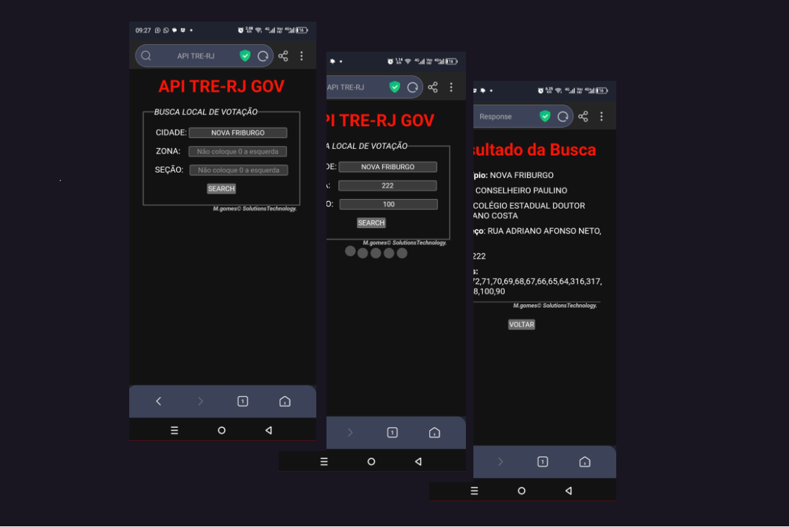

<h1 align="center"> Local de Votação </h1>

    Trata-se de um app, que informa o local de votação do usuário em todo estado do Rio de Janeiro, através de dados fornecidos do título de eleitor, como cidade,a zona eleitoral e sua seção. 
    

  <a href="#-tecnologias">Tecnologias</a>&nbsp;&nbsp;&nbsp;|&nbsp;&nbsp;&nbsp;
  <a href="#-projeto">Projeto</a>&nbsp;&nbsp;&nbsp;|&nbsp;&nbsp;&nbsp;
  <a href="#-layout">Layout</a>&nbsp;&nbsp;&nbsp;|&nbsp;&nbsp;&nbsp;
  <a href="#memo-licença">Licença</a>

  

 

  

## 🚀 Tecnologias

Esse projeto foi desenvolvido com as seguintes tecnologias:

- CSS
- JavaScript
- NodeEjs
- npm 
- Git e Github
- API

## 💻 Projeto

    Através de uma API aberta do governo, foi criado um projeto do qual podemos acessar a localidade das zonas eleitoreiras do estado do Rio de Janeiro. 
    Aprofundando o estudo de APIs, e utilização de nodeJS para do lado servidor com paginas desenvolvidas com nodeEJS.

    Aplicação transportada para a ferramenta Replit, onde pode ser executada como servidor no ambiente local, fora do editor Visual Studio.

[Uma vez o sevidor executado, visite o projeto online](bit.ly/votolocal)

## 🔖 Layout

O Layout do projeto é de deselvolvimento próprio, usando de simplicidade, visando a mecânica e utilização. 

## :memo: Considerações

Esse projeto está sob a licença MIT. 
API usada: https://apps.tre-rj.jus.br/api-dados-abertos/locaisvotacao

---

Feito com ♥ by M. Gomes :wave: [Visite-nos no Github](https://github.com/celo-gomes)
